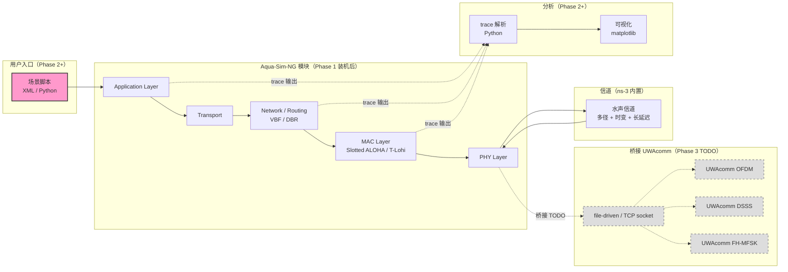

# UWAnet — 水声通信组网协议仿真

> Underwater Acoustic Network Protocol Simulation
>
> 基于 **Aqua-Sim-NG (ns-3)** 的水声组网协议仿真平台。物理层复用 **UWAcomm** 算法成果，专注 MAC / 路由 / 拓扑层协议研究。

---

## 项目概述

**前期调研阶段**（2026-04 起）。研究目标：

- 在 ns-3 的 Aqua-Sim-NG 框架上构建水声网络仿真
- 物理层接入 UWAcomm 的 OFDM / DSSS / FSK 实现
- 评估 MAC 协议（Slotted ALOHA / T-Lohi / Multi-channel）和路由协议（VBF / DBR / HHVBF）
- 输出场景：5 节点星型 / 网型 / 多跳；中等节点（10-30）

```
应用层  ──►  传输层  ──►  网络层（路由）  ──►  MAC 层  ──►  物理层（PHY）
                                                            │
                                                            ▼
                                                    UWAcomm 算法接入
                                                    （OFDM / DSSS / FSK）
                                                            │
                                                            ▼
                                                    水声信道（多径 / 时变 / 长延迟）
```

---

## 关联项目

- **UWAcomm**（[本地](../UWAcomm) / [GitHub](https://github.com/lyrenleigh-code/UWAcomm)）— 物理层算法源仓，OFDM/DSSS/FSK 可直接复用
- **USBL**（[本地](../USBL) / [GitHub](https://github.com/lyrenleigh-code/USBL)）— 节点定位（potential 接入）
- **前期调研笔记**：
  - `raw/notes/uwanet-moc-v1.md` — 知识地图 v1
  - `raw/notes/protocol-sim-brainstorm.md` — 协议仿真头脑风暴

---

## 当前状态（2026-05-25）

| 阶段 | 状态 | 说明 |
|------|------|------|
| Phase 0 — 调研笔记摄入 | 🟢 完成 | `raw/notes/` 落地 + Hub `uwanet-protocol-sim-note` 摘要 |
| Phase 1 — Aqua-Sim-NG 环境搭建 | 🟡 进行中 | **M0 规划文档 + M1 装机三件套已 push**（同步 dry-run worktree，commit `198e155`） |
| Phase 2 — Slotted ALOHA 5 节点 baseline | 🔴 未开始 | 首个 demo 案例 |
| Phase 3 — UWAcomm PHY 接入 | 🔴 未开始 | C++/MATLAB 桥接方案待定 |
| Phase 4 — 多协议对比评测 | 🔴 未开始 | T-Lohi / DBR 等 |

参考方法论：[autonomous-new-project-workflow](https://github.com/lyrenleigh-code/Ohmybrain/blob/main/wiki/explorations/autonomous-new-project-workflow.md)（UWAnet 是首个采用此方法论重建的项目）。

---

## 调用关系图（规划中 / 占位）

> ⚠️ **占位章节**：项目当前在 Phase 0-1 调研，尚无 ns-3 模块代码可画**实际**调用关系。本图反映**规划中**的 Aqua-Sim-NG 骨架 + UWAcomm PHY 接入点。Phase 2-3 代码落地后填实。
>
> 渲染：GitHub / GitLab / Obsidian 直接显示 Mermaid。



**TODO 项**（虚线 + 灰色节点 = Phase 3 待实现）：
- `BRIDGE` UWAcomm 桥接：file-driven trace（首选）或 TCP socket，方案待定
- `UC_OFDM / UC_DSSS / UC_FSK`：UWAcomm 物理层算法接入，C++/MATLAB 互操作

## 数据流图（规划中 / 占位）

> ⚠️ **占位章节**：反映**规划中**的协议栈数据流。Phase 3 PHY 接入后填实接口契约。

```mermaid
graph LR
    APP_IN[应用层负载<br/>bytes] --> NET_PKT[NetworkPacket<br/>+ src/dst]
    NET_PKT --> MAC_FRAME[MAC Frame<br/>+ slot/timing]
    MAC_FRAME --> PHY_BITS[PHY bits<br/>+ modulation]
    PHY_BITS -.桥接 TODO.-> UWAcomm_IN[UWAcomm PHY<br/>OFDM/DSSS/FSK]
    UWAcomm_IN -.-> WAV[waveform<br/>passband samples]
    WAV --> CH_OUT[ns-3 水声信道]
    CH_OUT --> WAV_RX[接收 waveform]
    WAV_RX -.-> UWAcomm_OUT[UWAcomm 解调]
    UWAcomm_OUT -.-> PHY_RX[PHY bits 恢复]
    PHY_RX --> MAC_RX
    MAC_RX --> NET_RX
    NET_RX --> APP_OUT[应用层接收]

    TRACE_OUT[trace 输出<br/>各层]:::todo
    APP_IN -.trace.-> TRACE_OUT
    MAC_FRAME -.trace.-> TRACE_OUT
    APP_OUT -.trace.-> TRACE_OUT

    style APP_IN fill:#bbf
    style APP_OUT fill:#bfb
    style CH_OUT fill:#fbb
    classDef todo fill:#ddd,stroke:#999,stroke-width:2px,stroke-dasharray: 5 5
```



## 接口表（规划中 / 占位）

> ⚠️ **占位章节**：Phase 1 装机后填 Aqua-Sim-NG 内置接口；Phase 3 桥接接入 UWAcomm 后补 PHY 桥接接口。

| # | 接口 | 输入 | 输出 | 状态 |
|---|---|---|---|---|
| 1 | Aqua-Sim-NG MAC layer API | `Packet` + `slot/timing` | `enqueue / dequeue` | 🔴 Phase 1 装机后填 |
| 2 | Aqua-Sim-NG PHY layer API | PHY bits + `modulation_type` | waveform → ns-3 channel | 🔴 Phase 1 装机后填 |
| 3 | UWAcomm 桥接（file-driven）| bits + `scheme`（'OFDM'/'DSSS'/'FSK'）| wav 文件 → trace | 🔴 Phase 3 待定 |
| 4 | UWAcomm 桥接（TCP socket，备选）| bits + `scheme` | 实时 IQ stream | 🔴 Phase 3 待定 |
| 5 | trace 解析 API（Python）| ns-3 `.tr` 文件 | DataFrame + 协议指标 | 🔴 Phase 2 后做 |

**TODO（待 Phase 2-3 填实）**：
- Phase 2 Slotted ALOHA 5 节点 baseline 落地后，本表 #1-#2 补实际函数签名
- Phase 3 UWAcomm 桥接落地后，本表 #3-#4 二选一并补具体协议（trace 文件格式 / TCP 协议）
- Phase 2+ 分析脚本落地后，#5 补 Python 解析函数签名

> 模块级详细接口表（参数维度/物理含义/实测样例）参照范例：`D:/Claude/worktrees/UWAcomm_usbl-calibration/src/calibration/W1/README.md` § 6.1（engineering 类首个完整范例，UWAnet 代码落地后照此粒度填实）

---

## 技术栈

| 层 | 选型 | 理由 |
|----|------|------|
| **仿真框架** | Aqua-Sim-NG（基于 ns-3.31+） | 水声网络主流，开源，社区活跃 |
| **底层语言** | C++（ns-3 模块开发） | Aqua-Sim-NG 原生 |
| **分析脚本** | Python | trace 解析 + 可视化 |
| **物理层接入** | UWAcomm（MATLAB） | 通过文件 / TCP socket 桥接 |
| **场景描述** | XML / Python script | ns-3 标准 |

---

## 目录结构

```
UWAnet/
├── CLAUDE.md                # Claude Code 项目指令
├── README.md                # 本文件
│
├── raw/                     # 只读原始资料
│   ├── papers/              # 协议论文 PDF
│   └── notes/               # 调研笔记（uwanet-moc-v1 / protocol-sim-brainstorm）
│
├── wiki/                    # 项目知识层
│   ├── index.md             # 页面索引
│   ├── log.md               # 操作日志
│   ├── dashboard.md         # 项目仪表盘
│   ├── concepts/            # 概念页（uwa-networking 等）
│   ├── architecture/        # 系统架构
│   └── source-summaries/    # 论文/资料摘要
│
├── specs/active/            # 当前任务 spec
├── specs/archive/           # 已完成 spec
├── plans/                   # 实现计划
├── src/                     # 源代码（ns-3 C++ 模块 + Python 分析脚本）
├── tests/                   # 自动化测试
├── evals/                   # 评测
├── workflows/               # 操作流程
├── scripts/                 # 自动化脚本
├── .claude/                 # harness（rules / skills / hooks）
└── .obsidian/               # Obsidian vault 配置
```

---

## 计划研究的协议

### MAC 层

| 协议 | 类别 | 备注 |
|------|------|------|
| **Slotted ALOHA** | 时分 | baseline，5 节点首例 |
| **T-Lohi** | Tone-based handshake | 长延迟下避免冲突 |
| **Multi-channel MAC** | 多频段 | UWAcomm OFDM 多频段支撑 |
| **CDMA-MAC** | 码分 | UWAcomm DSSS 支撑 |

### 路由层

| 协议 | 类别 | 备注 |
|------|------|------|
| **VBF**（Vector-Based Forwarding） | 地理 | 经典 |
| **HHVBF**（Hop-by-Hop VBF） | 地理逐跳 | 改进版 |
| **DBR**（Depth-Based Routing） | 深度 | 无需位置 |
| **AODV** 适配 | 反应式 | 陆地协议适配水下 |

### 拓扑

- 5 节点星型 / 网型（baseline）
- 10-30 节点中等规模（中期）
- 移动节点 + USBL 定位（远期）

---

## 调研笔记速览（raw/notes/）

详见 Hub：[uwanet-protocol-sim-note](https://github.com/lyrenleigh-code/Ohmybrain/blob/main/wiki/source-summaries/uwanet-protocol-sim-note.md)

主要结论：

1. **Aqua-Sim-NG > Aqua-Sim**：基于 ns-3，社区维护更活跃
2. **物理层桥接** 推荐通过文件 I/O（trace driven）而非实时 RPC
3. **首例案例** 选 Slotted ALOHA 5 节点（最简，验证仿真链路）
4. **学习路线** 1 个月：ns-3 基础（1 周）+ Aqua-Sim-NG（1 周）+ MAC 层定制（2 周）
5. **新概念** `uwa-networking` 提议加入 Hub `wiki/concepts/`

---

## 两个闭环

### 知识闭环

```
raw/ ──► /ingest ──► wiki/source-summaries/ ──► query ──► /promote ──► Ohmybrain Hub
```

### 开发闭环

```
01-spec ──► 02-plan ──► 03-implement(C++ ns-3 模块 + Python 分析) ──► 04-validate(测试 + 同步 wiki + 归档 spec + commit)
```

**每个代码任务先在 `specs/active/` 写 spec**，非平凡实现先在 `plans/` 写计划。

---

## 自动化保障（Hooks）

| 时机 | 检查 | 脚本 |
|------|------|------|
| PreToolUse | 阻断 raw/ 写入 | `check_raw_write.py` |
| PreToolUse | 阻断 `<private>` 外泄 | `check_private_tags.py` |
| PostToolUse | Wiki 快速检查 | `lint_wiki.py --quick` |
| Stop | Wiki index/log 同步 | `check_index_log_sync.py` |
| Stop | 任务完整性验证 | `validate_task.py` |

详见 [`CLAUDE.md`](CLAUDE.md) 的 Hook Exit Code Strategy。

---

## 常用命令

| 命令 | 用途 |
|------|------|
| `/ingest` | 摄入 raw/ 资料到 wiki/（7 步） |
| `/promote` | 回流跨项目结论到 Hub（5 步） |
| `python scripts/lint_wiki.py` | Wiki 结构检查 |
| `python scripts/sync_index.py` | 同步 index 页面计数 |
| `python scripts/validate_task.py` | 任务完成验证 |
| `python scripts/scrape.py <URL>` | Firecrawl 网页抓取到 raw/ |
| `python scripts/transcribe.py <文件>` | Whisper 音视频转录到 raw/ |

---

## 项目内导航

- **仪表盘**：[`wiki/dashboard.md`](wiki/dashboard.md)
- **调研笔记**：[`wiki/source-summaries/uwanet-brainstorm.md`](wiki/source-summaries/uwanet-brainstorm.md)
- **知识地图（草）**：`raw/notes/uwanet-moc-v1.md`

---

## 关联

- **Hub**：`D:\Claude\Ohmybrain` — 跨项目知识中心（领域知识查询用 `/promote`）
- **模板**：`D:\Claude\ohmybrain-core` — 项目派生源
- **物理层依赖**：UWAcomm（MATLAB），通过 file-driven 桥接

---

## 远端

- **GitHub**：https://github.com/lyrenleigh-code/UWAnet
- **GitLab 内网**：http://192.168.10.100:8880/lilin/UWAnet

---

## 许可

内部项目，仅供本人 + 授权内部协作者使用。
