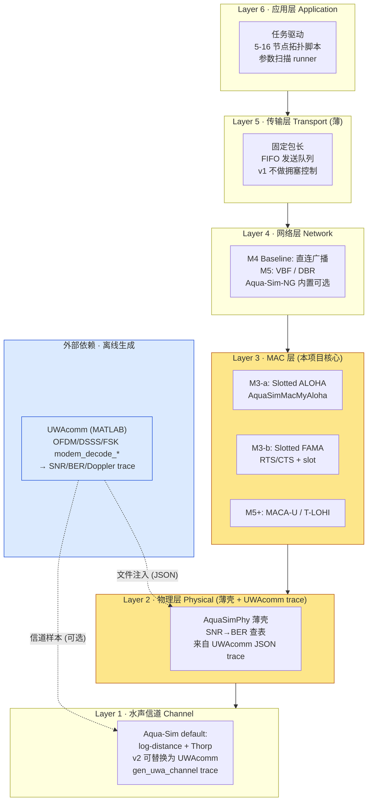
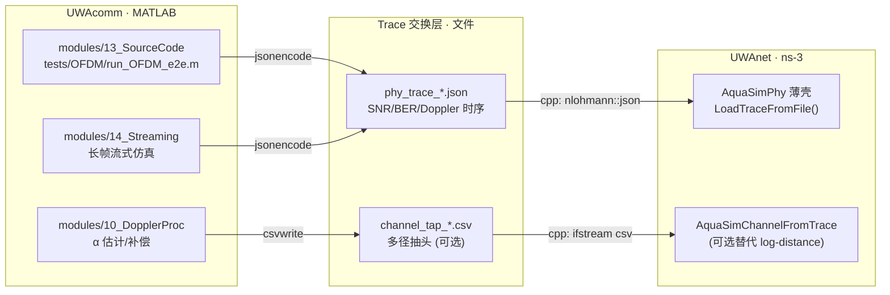
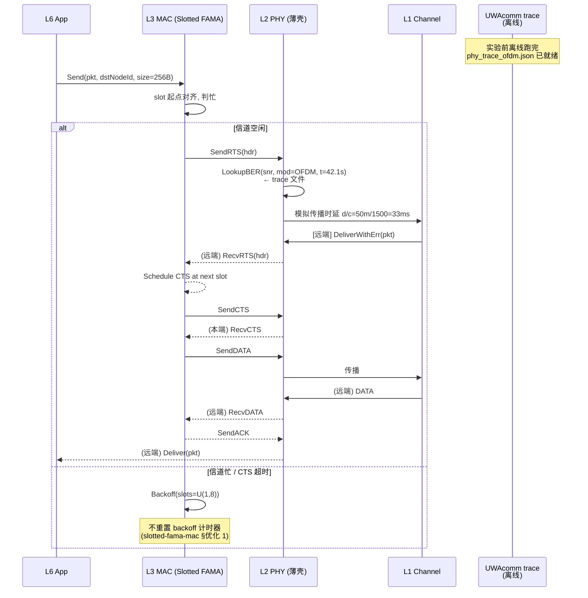

# UWAnet 架构规划

> 对齐 [[specs/active/M0-charter.md]] 与 [[plans/roadmap.md]]。
> 满足主仓成功标准 #3-#7:**≥5 层协议栈图 / 每层选型理由 / UWAcomm 接口定义 /
> 三依赖识别**。
> **接口表语义纯度约束**(§3.2):每行必须是跨项目接口/信号,**禁止混入 ns-3
> 内部参数等无关项**。

---

## 1. 协议栈(Mermaid flowchart TB)



**图元说明**:黄色高亮层为本项目工程重点;蓝色为离线外部依赖。`.-> ` 虚线表示
文件/数据接口(非进程内调用)。

---

## 2. 每层选型理由

### L6 应用层

- **选型**:C++ 直写仿真入口 + bash runner,**不用 Python binding**。
- **理由**:ns-3 Python 绑定在 3.41 上体验仍不稳,且 UWAnet 只需少量"创建 N 节点
  → 配拓扑 → 跑 N 秒"的胶水脚本。参见 [[wiki/source-summaries/ns3-documentation-index]]
  §不推荐深读的内容。

### L5 传输层

- **选型**:薄层,仅 FIFO 应用包队列,**不实现 UWAN-TCP / ALOHA-Q**。
- **理由**:[[raw/notes/uwanet-moc-v1.md]] §技术路线把传输层列为"高阶目标",M0-M4
  主线落在 MAC/路由。保留接口占位,避免未来重构。

### L4 网络层

- **选型**:M4 前只做直连广播(单跳);M5 扩 **VBF**(Vector-Based Forwarding)。
- **理由**:[[wiki/source-summaries/aqua-sim-family]] §Aqua-Net 架构亮点已确认
  Aqua-Sim-NG 内置 VBF/VBVA/AODV,M5 属于"接上挂载"而非"从零实现",工时可控。
  DBR/EEDBR 需要深度水位信息,先不做。

### L3 MAC 层(本项目核心)

- **选型**:**Slotted ALOHA → Slotted FAMA → (MACA-U)** 三协议梯度。
- **理由**:对照 [[raw/notes/protocol-sim-brainstorm.md]] §六 MAC 协议分类:
  - **竞争型起步**:ALOHA 是公认的 underwater MAC 教科书入口([[wiki/source-summaries/aqua-sim-family]]
    §UW-Aloha 案例已有 BEB vs PB 数据可对标)。
  - **握手型进阶**:Slotted FAMA 专门解决水声长传播延迟下的 RTS 长度问题
    ([[wiki/source-summaries/slotted-fama-mac]] §Slotted FAMA 设计)。
  - **路径清晰**:从 "无 CS → 有 CS(CSMA) → 握手(MACA) → 槽化握手(Slotted FAMA)"
    形成教学级递进。
- **替代方案**:JANUS 的 CSMA/CA+BEB([[wiki/source-summaries/janus-standard]]
  §MAC 层)可作为 M5+ 的第四 baseline。

### L2 物理层

- **选型**:**ns-3 侧只做薄壳 `AquaSimPhy`,SNR→BER 查表**。
- **理由**:重造 OFDM/OTFS 需要几周,UWAcomm 已有 6 体制端到端测试产出 BER,用
  JSON trace 离线注入是性价比最高的路径。v1 允许 trace 不实时,实验的时间尺度
  是 100s-1000s,trace 级粗粒度足够。

### L1 水声信道

- **选型**:v1 沿用 Aqua-Sim-NG 自带 **log-distance + Thorp** 模型;v2 可替换为
  UWAcomm 的 `gen_uwa_channel` 生成的时变样本文件([[D:/Claude/TechReq/UWAcomm/wiki/index.md]]
  §14 流式仿真框架)。
- **理由**:v1 先让协议跑起来,再追信道保真度。升级路径已预留(PHY trace schema
  预留 `channel_sample_path` 字段)。

---

## 3. 与 UWAcomm 的接口(关键)

### 3.1 接口总览图



### 3.2 接口表(机器可判 Schema — 仅跨项目接口/信号)

> **表语义纯度约束**:每行必须是 UWAcomm ↔ UWAnet 或 UWAnet ↔ 后处理层的
> **跨边界接口/信号**。ns-3 内部参数、单进程 CLI、模块内部方法**不进此表**,
> 统一移到 §3.5 ns-3 运行时参数(下方)。

| 调用方 | 数据格式 | 必填字段 | 返回/消费方 | 失败处理 |
|--------|---------|---------|------------|---------|
| UWAcomm `modem_decode_ofdm.m` | JSON Lines 文件 `phy_trace_*.json` | `timestamp_s`(float) / `snr_db`(float) / `ber`(float ∈[0,0.5]) / `modulation`(enum OFDM/OTFS/DSSS/FH-MFSK/SC-FDE/SC-TDE) / `node_id`(int) / `seed`(int) | ns-3 `AquaSimPhy::LoadTraceFromFile()` | 字段缺失 → 抛 `TraceFormatError`, 主进程退出码 2;BER 越界 → 告警并 clamp 到 [0,0.5] |
| UWAcomm `gen_uwa_channel.m`(可选, v2) | CSV `channel_tap_*.csv` | `tap_idx`(int) / `delay_us`(float) / `gain_re`(float) / `gain_im`(float) / `t_block`(int) | ns-3 `AquaSimChannelFromTrace::LoadTaps()` | 文件不存在 → 回退到 log-distance,stderr 打印 `[channel] fallback to default` |
| UWAnet `main.cc` benchmark 结果 | CSV `evals/sweep-*/results.csv` | `mac`(str) / `n_nodes`(int) / `arrival_lambda`(float) / `throughput_bps`(float) / `e2e_delay_s`(float) / `pdr`(float ∈[0,1]) | Python 后处理 `plot_results.py` + matplotlib / pandas | 缺列 → `KeyError` 并附列名打印;CSV 无数据行 → 退出码 3 |

### 3.3 接口版本控制

- **v1 (M2-M3)**:JSON Lines 单向,无 real-time,每 1000 个包 flush 一次。
- **v1.5 (M4)**:加入 `run_id`(对应扫描点 hash),支持多实验并发。
- **v2 (M5+)**:可选实时 socket(UDP 9001)或 ZMQ;v1 不做,避免引入双进程联调风险。

### 3.4 UWAcomm 物理层模块对应关系

对照 [[D:/Claude/TechReq/UWAcomm/wiki/index.md]] §Modules,以下模块可产生 trace:

| UWAcomm 模块 | 输出指标 | 对应 trace 字段 |
|-------------|---------|--------------|
| `modules/13_SourceCode/tests/OFDM/` | BER, SNR | `modulation="OFDM"`, `ber`, `snr_db` |
| `modules/13_SourceCode/tests/DSSS/` | BER, 扩频增益 | `modulation="DSSS"`, `ber` |
| `modules/13_SourceCode/tests/OTFS/` | BER(含 Doppler) | `modulation="OTFS"`, `doppler_hz` |
| `modules/13_SourceCode/tests/FH-MFSK/` | BER(鲁棒低速) | `modulation="FH-MFSK"` |
| `modules/10_DopplerProc` | α 估计误差 | `doppler_alpha_est` |
| `modules/14_Streaming` | 长时 BER 序列 | 连续 `timestamp_s + ber` |

> [!warning] UWAcomm 端需新增"逐帧 BER 持久化 + jsonencode 导出"能力(2026-04-27 决策)
> 现有 UWAcomm 端到端测试**只 save 整段均值**,无逐帧 BER 序列。M4 接入真实 trace
> 需要 UWAcomm 侧新增 `export_phy_trace.m`(写在 UWAcomm 自己的 `scripts/export/`
> 下,逐帧 dump JSON Lines)。**走"用户提 PR"路径**——本项目 agent **不**自动改
> UWAcomm 源树(对齐 `red_lines.never_touch: D:/Claude/TechReq/UWAcomm`),
> 见 [[plans/risks.md]] §R-X1。M3 阶段先用占位 trace 推进 MAC 实现,M4 启动前
> 等 UWAcomm 侧 PR 落地。

### 3.5 ns-3 运行时参数(非跨项目接口,供参考)

> 本段是 UWAnet **内部** CLI / runtime,不是跨项目接口,**不计入 §3.2 接口表**。
> 列出仅供 Generator 实现时对齐,避免后续混入接口表。

- `--trace-file=path/to/phy_trace.json` — 指定 §3.2 表格第一行的 JSON 输入路径。
- `--seed=42` — ns-3 `RngSeed`,影响 MAC 退避随机性。
- `--n-nodes=5` — 节点数,驱动 §3.1 拓扑脚本。
- `--sim-time=100` — 仿真秒数,默认 100 s。
- **失败处理**:参数缺失 → 打印 usage 并退出码 1。

---

## 4. 数据流:应用层 → 物理层(一次完整传输)



**关键时间尺度**(对照 [[wiki/source-summaries/slotted-fama-mac]] §槽长定义):

- 传播时延 `T_prop ≈ 1 s / 1.5 km`,典型 5 节点 100 m 间距 → 67 ms。
- 槽长 `T_slot = T_max_prop + γ_CTS` ≈ 130 ms(γ_CTS = CTS 100 bit / 1 kbps)。
- 完整 RTS-CTS-DATA-ACK:4 槽 + T_data ≈ 0.5-2 s 量级。
- 仿真 100 s → 单链路 ≈ 50-200 次成功传输。

---

## 5. 目录布局(Generator 使用)

```
D:/Claude/TechReq/UWAnet/
├── specs/active/
│   ├── M0-charter.md                      ← 本轮 v3
│   └── phy-trace-schema.md                ← M2 产出
├── plans/
│   ├── roadmap.md                         ← 本轮 v3
│   ├── architecture.md                    ← 本文
│   └── risks.md                           ← 本轮 v3
├── src/
│   ├── setup/
│   │   └── install_ns3_aquasim.sh         ← M1(已落地,2026-04-21 真装机过)
│   ├── aqua-sim/model/                    ← M3 链入 ns-3 源码树(WSL 侧)
│   │   ├── aqua-sim-mac-myaloha.{h,cc}
│   │   └── aqua-sim-mac-slottedfama.{h,cc}
│   └── runner/
│       └── main.cc                        ← ns-3 scratch/ 入口
├── tests/
│   ├── smoke/test_aqua_sim_aloha.py       ← M1(已落地,stub 模式可跑)
│   ├── trace/test_phy_trace_load.cc       ← M2
│   └── mac/
│       ├── test_myaloha_5nodes.cc
│       └── test_slottedfama_5nodes.cc
├── workflows/
│   ├── 01-env-setup.md                    ← M1(已落地)
│   └── 02-custom-mac.md                   ← M3
├── scripts/benchmark/
│   ├── run_sweep.sh                       ← M4
│   └── plot_results.py                    ← M4
└── evals/sweep-YYYY-MM-DD/
    ├── results.csv
    └── figures/*.png
```

## 6. 依赖清单(M0-charter §成功标准 #7)

| 依赖 | 版本/形式 | 用途 | 获取方式 |
|------|----------|------|---------|
| **UWAcomm** | 现有 MATLAB 源码(`D:/Claude/TechReq/UWAcomm`) | 离线产生 phy_trace JSON | 只读引用,**不修改 UWAcomm 源树**;需 UWAcomm 侧自行加 `export_phy_trace.m`(走 PR 路径,见 R-X1) |
| **ns-3** | **3.41**(2026-04-21 dry-run 实测兼容 Aqua-Sim-NG) | 事件驱动仿真核心 | `git clone --branch ns-3.41 --depth 1 https://gitlab.com/nsnam/ns-3-dev.git` |
| **Aqua-Sim-NG** | latest `master`(rmartin5/aqua-sim-ng,2026-04-21 dry-run 已实装 2015/2015 编过) | MAC/网络协议栈,PhyLayer 薄壳 | `git clone https://github.com/rmartin5/aqua-sim-ng` 到 `src/aqua-sim-ng/` |
| Python | 3.10 | 后处理 + smoke test | apt |
| matplotlib | any | 画图 | pip |
| nlohmann/json | 3.x | C++ JSON 解析 | `apt install nlohmann-json3-dev` |

## Changelog

- **v1 (2026-04-21)**:dry-run worktree 首次生成,6 层协议栈 + UWAcomm 接口 schema +
  数据流时序。
- **v2 (2026-04-21)**:dry-run worktree 响应 `.checkpoint/eval-1.md` 阻断项,
  §3.2 接口表新增"仅跨项目接口/信号"语义纯度约束;CLI 参数从接口表搬到
  §3.5 ns-3 运行时参数;§3.4 注记明确 `scripts/uwacomm_bridge/` 写本项目侧。
- **v3 (2026-04-27)**:从 worktree 同步回主仓。
  1. §5 目录路径从 `D:/Claude/worktrees/uwanet-redo/` 改为 `D:/Claude/TechReq/UWAnet/`,
     标记 M1 三件套已落地。
  2. §6 ns-3 版本从 `3.36` 改为实测的 `3.41`;Aqua-Sim-NG 仓库表述补
     "dry-run 已实装 2015/2015 编过"。
  3. §3.4 [!warning] 改写:对齐 Q1 决策"UWAcomm 端需新增逐帧 BER 持久化 +
     jsonencode 导出",走"用户提 PR"路径,不再做"本项目侧合成"兜底;
     `scripts/uwacomm_bridge/` 不再用作合成桥接位置。
  4. §6 UWAcomm 行的"非侵入扩展"表述改为"需 UWAcomm 侧自行加 export_phy_trace.m
     走 PR 路径",对齐红线 `never_touch: D:/Claude/TechReq/UWAcomm`。
  5. 顶部 blockquote 删 `goal.yaml.rubric.architecture.required_items` 引用,
     改为对齐 charter §成功标准 #3-#7。
